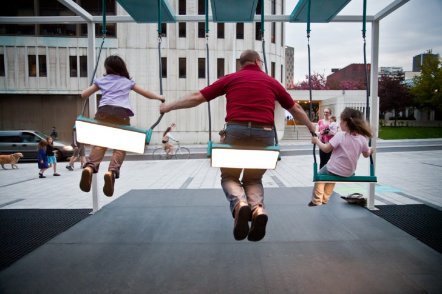
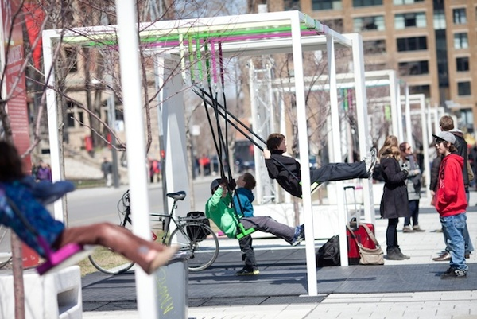
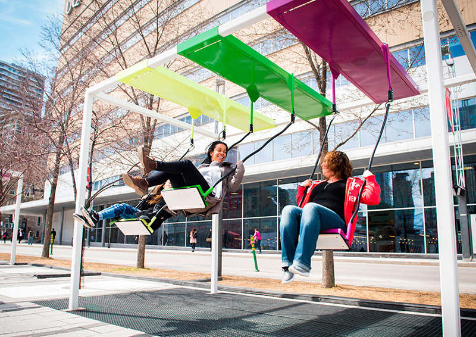
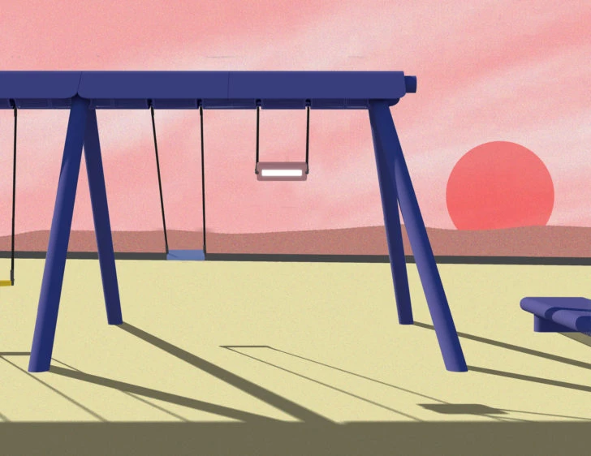
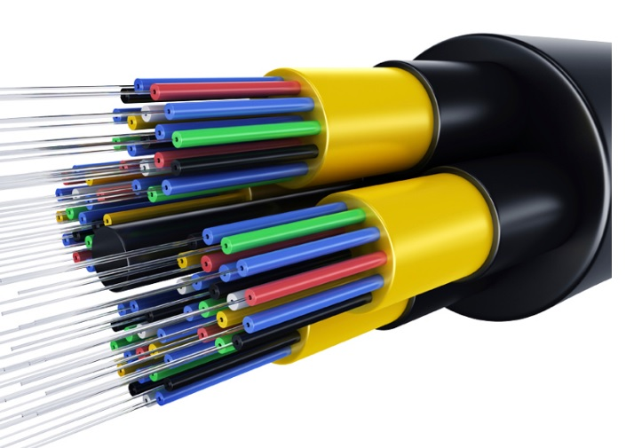

# Pour la troisième présentation je parle d'un projet multimédia de façon détaillé. #

# Balançoires musicales #

# Qui a produit ce projet de multimédia # 

## Daily tous les jours ##
### Daily tous les jours **réalise des éxpériences collectives pour l’espace public**. Fondé en 2010 à Montréal, ce studio d’art et de design **invite les humains à jouer un rôle critique dans la transformation de leur environnement**. ###

## Le but des balançoires musicales ##
###  Les balançoires Musicales est une installation interactive qui a été conçue pour créer des connexions entre les gens dans l’espace public. Imaginée comme une expérience collective, l’œuvre invite des personnes de tout âge à jouer spontanément de la musique ensemble sur une plateforme géante. **Aussi c’est un jeu intuitif qui favorisent la collaboration et l’écoute entre les participants**. ###

### Aussi le projet stimule l’appropriation de l’espace public, **réunissant des personnes de tous âges et origines**, afin de créer un lieu pour jouer en plein centre-ville. ###

# 4 informations qui sont importantes à savoir #

## Numéro 1 ## 
### **Chaque balançoire joue les notes d’un instrument classique**: *piano, guitare, harpe ou vibraphone*. **Un code de couleur les différencie** et invite le public à essayer différents sièges. ###

## Numéro 2 ##
### La trame sonore interactive est inspirée du pendule. **Le plus haut la balançoire, le plus haut la note** ###

## Numéro 3 ##
### Lorsque les balançoires se balancent toutes ensemble, **elles composent une pièce musicale unique**, dont certaines mélodies émergent grâce à la collaboration entre les participantes et les participants. ###

## Numéro 4 ##
### Les sonorités acoustiques **s’intègrent au mouvement des balançoires** *léger, aérien*  créant une musique qui se fond dans l’espace urbain. ###
### Le balancement simultané des 21 balançoires **engendre des mélodies aléatoires**. ###

# Certaines questions intéressantes à propos des balançoires musicales #

## Pourquoi avoir ajouter de la musique à ce projet? ##
### Nous recherchions de nouvelles formes d’interaction pour **stimuler la participation du public**. La musique offre une rétroaction directe qui permet facilement au public de prendre part au jeu parce qu’il en **comprend immédiatement le fonctionnement**. ###

## les balancoires sont installés durant combien de temps? ##
### Les balancoires sont installés au printemps et ils les enlèvent durant l'automne. ###

## Type de connexion ##
### C'est une connexion à **fibre optique**. ###

# Fin #

